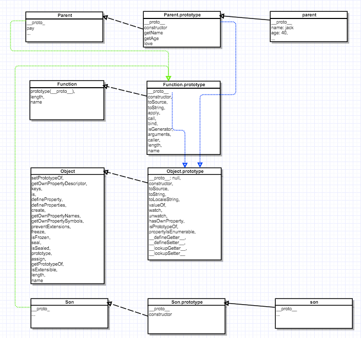
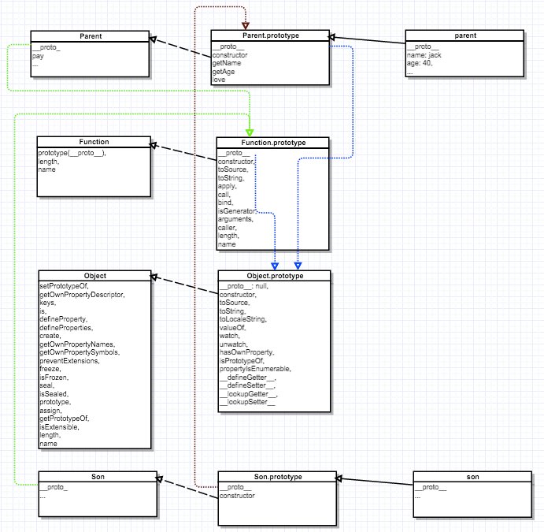
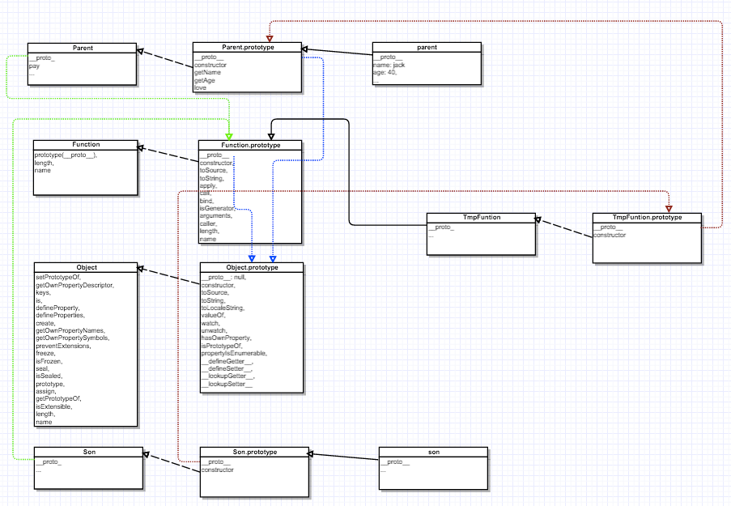

# javascript 中的继承


js 中继承比较复杂，坑比较多，最近有点时间整理下，记录下来。

js的继承实现方式大概分类如下的两大类，每一种实现都有自己的有点和缺点，更具场景选择吧

* 通过修改原型链来来实现继承
* 通过复制父类来来实现继承

为了理解继承的原型链的变化，我画了原型链图。下图是没有继承的时候，父类和子类的原型链图



```javascript

function Parent(name, age) {
    this.name = name;
    this.age = age;
}
Parent.prototype.getName = function () {
    return this.name;
};
Parent.prototype.getAge = function () {
    return this.age;
};
Parent.prototype.love = {
    game: ['DoTa']
};

Parent.pay = function(){
  return 1000;
};

function Son(){}
```


### 修改原型链来来实现继承

修改原型链也有好几种，现在分开来说：

##### 第一种：

实现原理: 修改原型链(子类的原型指向父类的原型)实现继承

优点: 简单

缺点: 子类修改影响父类

原型链图注意里面的红线



不调用构造方法实现

```javascript
function Son(){}
Son.prototype = new Parent();
Son.prototype.constructor = Son;
```

调用构造方法实现

```javascript
function Son(){
    Parent.apply(this, arguments)
}
Son.prototype = Parent.prototype;
Son.prototype.constructor = Son;
```

[详细代码实现](https://github.com/xuanxiao2013/f2e-practice/blob/master/javascript-inherit/inherit1.js)


##### 第二种：

实现原理: 修改原型链(通过加入临时函数，阻止子类修改父类)实现继承

优点: 子类即能继承父类，又基本不影响父类，达到真正意义上的继承

缺点: 实例的对象和父类原型的对象相同的时候(父类的love)，可能会出现子类修改父类对象原型中的所有属性被实例共享，共享很适合函数，对基本值的属性也可以（实例上添加同名属性），但是对引用类型的值的属性来说，就会有问题

原型链图注意里面的红线



ES3 实现方式[详细代码实现](https://github.com/xuanxiao2013/f2e-practice/blob/master/javascript-inherit/inherit2.js):

```javascript
function create(proto){
    var F = function(){};
    F.prototype = proto;
    return new F();
}

function Son(){
    Parent.apply(this, arguments);
}
Son.prototype = create(Parent.prototype);
Son.prototype.constructor = Son;
```

ES5 实现方式[详细代码实现](https://github.com/xuanxiao2013/f2e-practice/blob/master/javascript-inherit/inherit2.js):

```javascript
function Son(){
    Parent.apply(this, arguments);
 }
 Son.prototype = Object.create(Parent.prototype)
 Son.prototype.constructor = Son;
```

ES6 实现方式 [详细代码实现](https://github.com/xuanxiao2013/f2e-practice/blob/master/javascript-inherit/inherit4.es6):

```javascript
class Parent{
    constructor(name, age){
        this.name = name;
        this.age = age;
    }
}
Parent.prototype.getName = function () {
    return this.name;
};
Parent.prototype.getAge = function () {
    return this.age;
};
Parent.prototype.love = {
    game: ['DoTa']
};

class Son extends Parent {
    constructor(...args){
        super(...args);
    }
}
```
都说ES6 的Class 只是个语法糖，看来原因在这了


测试：

```javascript
var parent = new Parent('jack', 40);
log('parentName:' + parent.getName()); // parentName:jack
var son = new Son('tom', 20);
Son.prototype.getName = function(){
    return this.name + ' has good father';
};
log('sonName:' + son.getName()); // sonName:tom has good father
log('parentName:' + parent.getName()); // parentName:jack


log(Son.prototype.constructor === Son); // true
log(son instanceof Son); // true
log(son instanceof Parent); // true
log(son instanceof Object); // true


log('parent love:' + parent.love.game); // parent love:DoTa
log('son love:' + son.love.game); // son love:DoTa

log('------------------------');

// 注意这里
son.love.game = 'DoTa2';
log('parent love:' + parent.love.game); // parent love:DoTa2
log('son love:' + son.love.game); // son love:DoTa2

log('------------------------');
son.love = {
    game: 'DoTa3'
};
// 注意这里
log('parent love:' + parent.love.game); // parent love:DoTa2
log('son love:' + son.love.game); // son love:DoTa3
```

### 复制父类来来实现继承

实现原理：通过深度复制把父类的方法复制一份给子类来实现继承

优点: 子类即能继承父类，又不影响父类，达到真正意义上的继承

缺点: 复杂

[详细代码实现](https://github.com/xuanxiao2013/f2e-practice/blob/master/javascript-inherit/inherit3.js):
